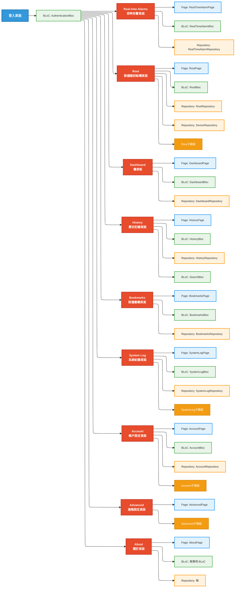
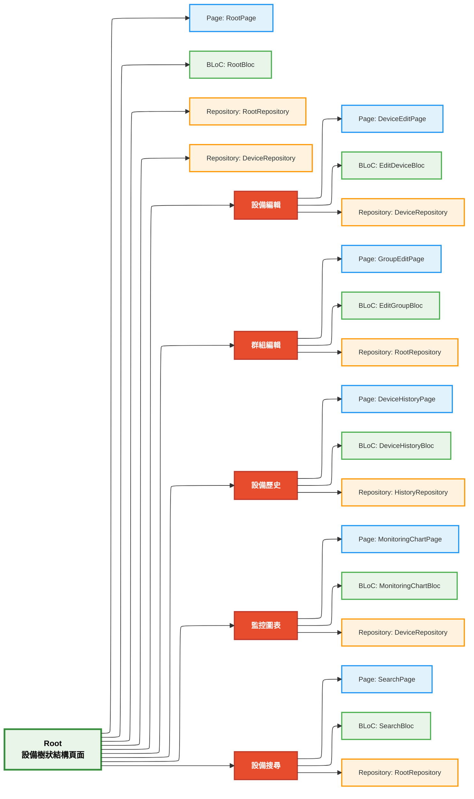
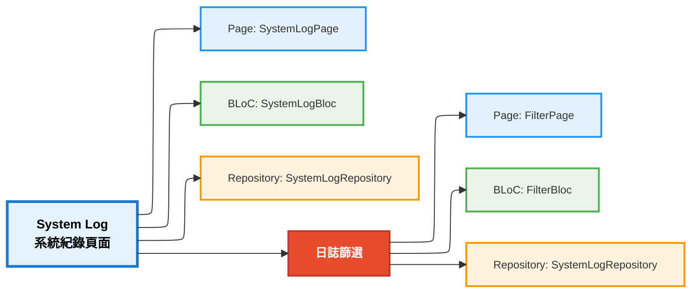
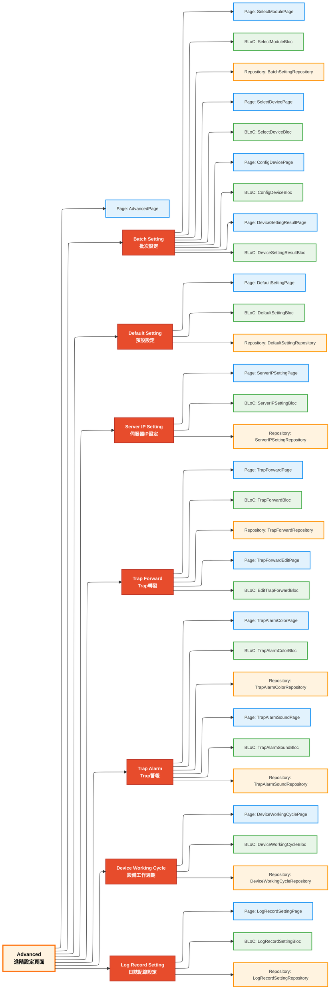
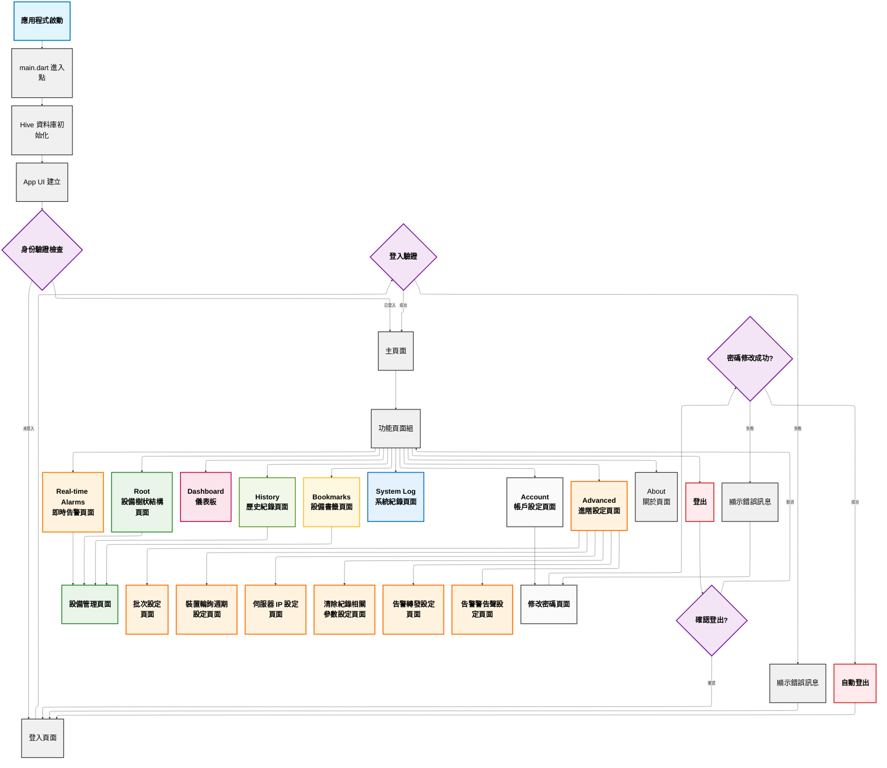

# Ricoms App

## 概述
Ricoms App 是一個基於 Flutter 開發的網路設備管理應用程式，支援 ACI 設備管理，包含 1.8G/1.2G 放大器(AMP)、光節點(Node) 及 DSIM 等設備。應用程式提供設備狀態監控、歷史資料查詢、實時告警處理等功能。

## 項目架構

### 設計原則
採用 BLoC 架構從介面到資料存取的完整分層設計，確保了程式碼的可維護性和模組化。

**核心設計原則：**
- **分層架構**：展示層 (Page)、業務邏輯層 (BLoC) 和資料層 (Repository)
- **模組化設計**：按功能劃分為 Root、Dashboard、History、RealTimeAlarm、Advanced、Account 等模組
- **狀態管理**：使用 BLoC 進行狀態管理和事件處理
- **資料分離**：Repository 確保資料存取邏輯的獨立性

### 資料流
1. **用戶操作**：Page 接收用戶輸入
2. **事件處理**：BLoC 處理業務邏輯和狀態管理
3. **資料存取**：Repository (資料層) 負責資料的讀取、寫入
4. **狀態更新**：BLoC 將處理結果通知 Page 更新介面

### 模組間的協作關係
- 每個功能模組都有獨立的 Page、BLoC 和 Repository
- HomePage 作為中央協調器，管理模組間的導航和狀態
- Repository 可以在多個模組間共享，實現資料的統一管理

## 目錄結構

```
lib/
├── main.dart                       # 應用程式入口點
├── app.dart                        # 應用程式配置
├── home/                           # 主頁面和導航
│   └── view/
├── authentication/                 # 認證模組
│   └── bloc/
├── login/                         # 登入功能
│   ├── bloc/
│   ├── models/
│   └── view/
├── root/                          # 根節點設備管理
│   ├── bloc/
│   ├── models/
│   └── view/
├── dashboard/                     # 儀表板
│   ├── bloc/
│   └── view/
├── history/                       # 歷史資料查詢
│   ├── bloc/
│   ├── model/
│   └── view/
├── real_time_alarm/              # 實時告警
│   ├── bloc/
│   └── view/
├── advanced/                     # 進階設定
│   ├── bloc/
│   └── view/
├── account/                      # 帳戶管理
│   ├── bloc/
│   ├── model/
│   └── view/
├── system_log/                   # 系統日誌
│   ├── bloc/
│   ├── model/
│   └── view/
├── bookmarks/                    # 書籤功能
│   ├── bloc/
│   └── view/
├── change_password/              # 密碼變更
│   ├── bloc/
│   └── view/
├── repository/                   # 資料存取層
│   ├── account_repository/
│   ├── advanced_repository/
│   ├── authentication_repository/
│   ├── bookmarks_repository/
│   ├── dashboard_repository/
│   ├── history_repository/
│   ├── real_time_alarm_repository/
│   ├── root_repository/
│   └── system_log_repository/
├── utils/                        # 工具類
│   ├── common_style.dart
│   ├── custom_errmsg.dart
│   └── message_localization.dart
├── custom_icons/                 # 自定義圖標
└── l10n/                        # 國際化
```

## 開發規範

### 命名規範
- **BLoC**: `功能名稱_bloc.dart`、`功能名稱_event.dart`、`功能名稱_state.dart`
- **介面**: `功能名稱_page.dart`（頁面）、`功能名稱_form.dart`（表單）
- **Repository**: `功能名稱_repository.dart`
- **Model**: `功能名稱.dart`

### 模組結構
每個功能模組都遵循標準結構：
```
功能模組/
├── bloc/                         # 業務邏輯層
│   ├── 功能名稱_bloc.dart
│   ├── 功能名稱_event.dart
│   └── 功能名稱_state.dart
├── model/                        # 資料模型（如需要）
│   └── 功能名稱.dart
└── view/                         # 展示層
    ├── 功能名稱_page.dart
    └── 功能名稱_form.dart
```

## 系統架構圖



## Root 設備管理模組架構圖



## SystemLog 系統日誌模組架構圖



## 進階設定模組架構圖



## 核心功能模組

### Root 模組
設備管理核心模組，提供設備瀏覽、編輯、監控圖表等功能。

### Advanced 模組
進階設定模組，包含：
- 批次設定 (Batch Setting)
- 預設設定 (Default Setting)
- Trap 轉發設定 (Trap Forward)
- 告警聲音/顏色設定
- 伺服器 IP 設定
- 日誌記錄設定

### Dashboard 模組
提供設備狀態概覽和統計圖表。

### History 模組
歷史資料查詢和分析功能。

### Real-time Alarm 模組
實時告警監控和處理。

## 應用程式流程圖



## 技術特點

- **框架**：Flutter 3.4.0+
- **狀態管理**：BLoC Pattern
- **資料持久化**：Hive
- **網路請求**：Dio
- **圖表元件**：FL Chart
- **國際化**：支援中英文
- **平台支援**：Android、iOS、macOS、Windows、Linux
